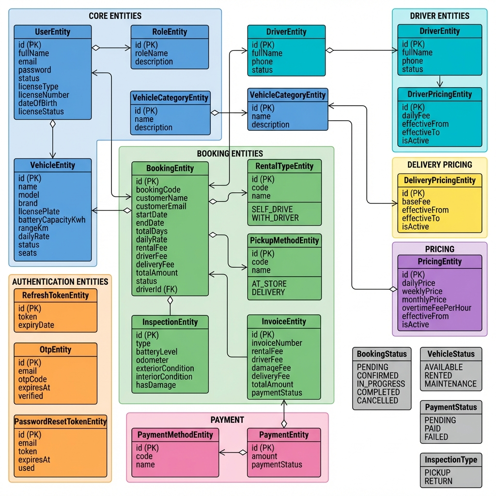

# Car Rental System - Database Class Diagram

## 📊 Class Diagram



---

## 📋 Entities Overview

### 🔵 Core Entities

| Entity | Table | Mô tả |
|--------|-------|-------|
| **UserEntity** | `users` | Thông tin người dùng, bằng lái |
| **RoleEntity** | `roles` | Vai trò: CUSTOMER, ADMIN, STAFF, OPERATOR |
| **VehicleEntity** | `vehicles` | Thông tin xe điện |
| **VehicleCategoryEntity** | `vehicle_categories` | Phân loại xe: Sedan, SUV, Compact, Luxury |

---

### 🟦 Driver Entities

| Entity | Table | Mô tả |
|--------|-------|-------|
| **DriverEntity** | `drivers` | Thông tin tài xế |
| **DriverPricingEntity** | `driver_pricing` | Bảng giá tài xế theo ngày |

---

### 🟢 Booking Entities

| Entity | Table | Mô tả |
|--------|-------|-------|
| **BookingEntity** | `bookings` | Đơn đặt xe |
| **RentalTypeEntity** | `rental_types` | Loại thuê: SELF_DRIVE, WITH_DRIVER |
| **PickupMethodEntity** | `pickup_methods` | Phương thức nhận: AT_STORE, DELIVERY |
| **InspectionEntity** | `inspections` | Kiểm tra xe: PICKUP, RETURN |
| **InvoiceEntity** | `invoices` | Hóa đơn |

---

### 🟣 Pricing Entities

| Entity | Table | Mô tả |
|--------|-------|-------|
| **PricingEntity** | `pricing` | Bảng giá theo category xe |
| **DeliveryPricingEntity** | `delivery_pricing` | Phí giao xe |

---

### 🩷 Payment Entities

| Entity | Table | Mô tả |
|--------|-------|-------|
| **PaymentMethodEntity** | `payment_methods` | Phương thức: CASH, VNPAY, MOMO |
| **PaymentEntity** | `payments` | Thanh toán |

---

### 🟠 Authentication Entities

| Entity | Table | Mô tả |
|--------|-------|-------|
| **RefreshTokenEntity** | `refresh_tokens` | JWT refresh token |
| **OtpEntity** | `otp_codes` | Mã OTP xác thực email |
| **PasswordResetTokenEntity** | `password_reset_tokens` | Token reset mật khẩu |

---

## 🔗 Relationships

```
┌─────────────────────────────────────────────────────────────────┐
│                       RELATIONSHIPS                             │
├─────────────────────────────────────────────────────────────────┤
│                                                                 │
│  User ──────────┬───────> Role (Many-to-One)                    │
│                 └───────> RefreshToken (One-to-One)             │
│                                                                 │
│  Vehicle ───────────────> VehicleCategory (Many-to-One)         │
│                                                                 │
│  VehicleCategory ───────> Pricing (One-to-Many)                 │
│                                                                 │
│  Booking ───────┬───────> Vehicle (Many-to-One)                 │
│                 ├───────> User (Many-to-One)                    │
│                 ├───────> RentalType (Many-to-One)              │
│                 ├───────> PickupMethod (Many-to-One)            │
│                 └───────> Driver (Many-to-One) [optional]       │
│                                                                 │
│  Inspection ────────────> Booking (Many-to-One)                 │
│                                                                 │
│  Invoice ───────────────> Booking (One-to-One)                  │
│                                                                 │
│  Payment ───────┬───────> Invoice (Many-to-One)                 │
│                 └───────> PaymentMethod (Many-to-One)           │
│                                                                 │
└─────────────────────────────────────────────────────────────────┘
```

---

## 💰 Pricing Logic

### Công thức tính giá booking:

```
┌─────────────────────────────────────────────────────────────────┐
│                      PRICING FORMULA                            │
├─────────────────────────────────────────────────────────────────┤
│                                                                 │
│  🚗 TỰ LÁI (SELF_DRIVE):                                        │
│     rental_fee = daily_rate × total_days                        │
│     total_amount = rental_fee + delivery_fee                    │
│                                                                 │
│  🧑‍✈️ CÓ TÀI XẾ (WITH_DRIVER):                                    │
│     rental_fee = daily_rate × total_days                        │
│     driver_fee = daily_driver_fee × total_days                  │
│     total_amount = rental_fee + driver_fee + delivery_fee       │
│                                                                 │
│  📦 DELIVERY FEE:                                               │
│     - AT_STORE: 0 VND                                           │
│     - DELIVERY: base_fee (từ delivery_pricing)                  │
│                                                                 │
└─────────────────────────────────────────────────────────────────┘
```

---

## 📂 Enums

### BookingStatus
| Value | Mô tả |
|-------|-------|
| `PENDING` | Chờ xác nhận |
| `CONFIRMED` | Đã xác nhận |
| `IN_PROGRESS` | Đang thuê |
| `COMPLETED` | Hoàn thành |
| `CANCELLED` | Đã hủy |

### VehicleStatus
| Value | Mô tả |
|-------|-------|
| `AVAILABLE` | Có sẵn |
| `RENTED` | Đang được thuê |
| `MAINTENANCE` | Đang bảo trì |

### PaymentStatus
| Value | Mô tả |
|-------|-------|
| `PENDING` | Chờ thanh toán |
| `PAID` | Đã thanh toán |
| `FAILED` | Thanh toán thất bại |

### InspectionType
| Value | Mô tả |
|-------|-------|
| `PICKUP` | Kiểm tra khi giao xe |
| `RETURN` | Kiểm tra khi trả xe |

---

## 📅 Created

- **Date**: 2026-02-04
- **Version**: 2.0
- **Author**: Auto-generated
