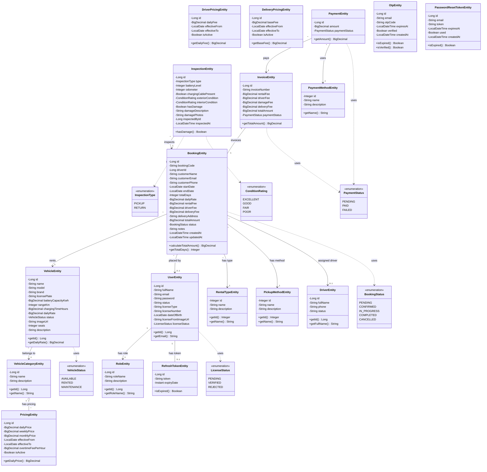

# Car Rental System - UML Class Diagram (Chuẩn UML 2.0)

## 📊 Class Diagram



---

## 📋 UML Notation Guide (Ký hiệu UML Chuẩn)

### Class Box Structure (Cấu trúc hộp Class)

```
┌─────────────────────────────────┐
│         <<stereotype>>          │  ← Stereotype (optional)
│          ClassName              │  ← Tên Class (bold)
├─────────────────────────────────┤
│ - privateAttribute: Type        │  ← Attributes
│ # protectedAttribute: Type      │     - private
│ + publicAttribute: Type         │     # protected
│                                 │     + public
├─────────────────────────────────┤
│ + publicMethod(): ReturnType    │  ← Methods
│ - privateMethod(): void         │
└─────────────────────────────────┘
```

### Visibility Symbols (Ký hiệu truy cập)

| Symbol | Meaning | Mô tả |
|--------|---------|-------|
| `+` | public | Truy cập từ mọi nơi |
| `-` | private | Chỉ truy cập trong class |
| `#` | protected | Truy cập từ class và subclass |
| `~` | package | Truy cập trong cùng package |

### Relationship Notation (Ký hiệu quan hệ)

| Notation | Name | Mô tả |
|----------|------|-------|
| `───────>` | Association | Quan hệ liên kết đơn hướng |
| `────────` | Association | Quan hệ liên kết hai hướng |
| `◇───────` | Aggregation | "Has-a" relationship (các phần có thể tồn tại độc lập) |
| `◆───────` | Composition | "Owns" relationship (các phần phụ thuộc hoàn toàn) |
| `─ ─ ─ ─>` | Dependency | Quan hệ phụ thuộc (dashed) |
| `────▷` | Inheritance | Kế thừa (hollow triangle) |
| `- - -▷` | Implementation | Triển khai interface |

### Multiplicity (Bội số)

| Notation | Meaning | Mô tả |
|----------|---------|-------|
| `1` | Exactly one | Chính xác 1 |
| `0..1` | Zero or one | 0 hoặc 1 (optional) |
| `*` | Zero or more | 0 hoặc nhiều |
| `1..*` | One or more | 1 hoặc nhiều |
| `n..m` | Range | Từ n đến m |

---

## 🔗 Relationships Detail

### Core Relationships

```
UserEntity (1) ─────────────────────────> (1) RoleEntity
    │                                         
    │ Mỗi User có đúng 1 Role
    │

UserEntity (1) ─────────────────────── (0..1) RefreshTokenEntity
    │
    │ Mỗi User có tối đa 1 RefreshToken (single session)
    │

VehicleEntity (*) ─────────────────────> (1) VehicleCategoryEntity
    │
    │ Nhiều Vehicle thuộc 1 Category
    │

VehicleCategoryEntity (1) ◇───────────── (*) PricingEntity
    │
    │ 1 Category có nhiều Pricing (Aggregation)
    │ Pricing có thể tồn tại độc lập
```

### Booking Relationships

```
BookingEntity (*) ─────────────────────> (1) VehicleEntity
    │
    │ Nhiều Booking cho 1 Vehicle

BookingEntity (*) ─────────────────────> (0..1) UserEntity  
    │
    │ Booking có thể có hoặc không liên kết User

BookingEntity (*) ─────────────────────> (1) RentalTypeEntity
    │
    │ Mỗi Booking có 1 loại thuê (SELF_DRIVE / WITH_DRIVER)

BookingEntity (*) ─────────────────────> (0..1) DriverEntity
    │
    │ Booking có tài xế (optional, chỉ khi WITH_DRIVER)

InspectionEntity (*) ─────────────────────> (1) BookingEntity
    │
    │ Mỗi Booking có 2 Inspection (PICKUP + RETURN)

InvoiceEntity (1) ────────────────────── (1) BookingEntity
    │
    │ Mỗi Booking có đúng 1 Invoice (One-to-One)
```

---

## 💰 Pricing Logic (UML Activity)

```
┌─────────────────────────────────────────────────────────────┐
│                 CALCULATE TOTAL AMOUNT                      │
├─────────────────────────────────────────────────────────────┤
│                                                             │
│  ●─────> [Get Rental Type]                                  │
│              │                                              │
│              ├──[SELF_DRIVE]──┐                             │
│              │                │                             │
│              │                ▼                             │
│              │    rental_fee = daily_rate × total_days      │
│              │    driver_fee = 0                            │
│              │                │                             │
│              ├──[WITH_DRIVER]─┤                             │
│              │                │                             │
│              │                ▼                             │
│              │    rental_fee = daily_rate × total_days      │
│              │    driver_fee = daily_driver_fee × total_days│
│              │                │                             │
│              └────────────────┼─────────────────────────────│
│                               ▼                             │
│               [Get Pickup Method]                           │
│                      │                                      │
│              ┌───────┴───────┐                              │
│              │               │                              │
│         [AT_STORE]      [DELIVERY]                          │
│              │               │                              │
│              ▼               ▼                              │
│    delivery_fee = 0    delivery_fee = base_fee              │
│              │               │                              │
│              └───────┬───────┘                              │
│                      ▼                                      │
│    total_amount = rental_fee + driver_fee + delivery_fee    │
│                      │                                      │
│                      ▼                                      │
│                      ◉                                      │
└─────────────────────────────────────────────────────────────┘
```

---

## 📅 Version Info

| Property | Value |
|----------|-------|
| **UML Version** | 2.0 |
| **Created** | 2026-02-04 |
| **Author** | Auto-generated |
| **Standard** | OMG UML Specification |
